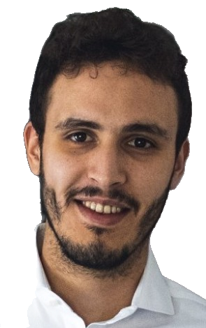

# Pictures Optimal Transport


## What is this repository ?


This repository uses optimal transport to compute the transformation between a
picture and another. It uses the same principle as this
repository (https://github.com/nbonneel/network_simplex) except
it is based on POT and this repository contains the full code to generate
such a video.


## How to use it ?

In order to use to it, you should change the configuration to your liking by
modifying conf.py. It includes parameters for the transportation as well as
the computation itself (SLURM parameters if you're using such a scheduler).

### With SLURM

If SLURM is available, you can launch the computation by executing the following
in the `src/` folder.
```
python3 launcher.py
```
This script will create a submission file for SLURM.

### Without SLURM

You can just launch the multiple scripts in the following order (inside the `src/` folder):
```
python3 transport.py
python3 make_pics.py
python3 merge_pics.py
```

A notebook is also available, although
it does not contain every feature of the script version (such as easing functions
or the ability to handle more than 2 pictures to create a cycle). As such, the
script version is recommended.


## An example

Here is a few examples computed with 40k points.

<p align="middle">
<td></td>
<td></td>
<td></td>
</p>

<hr>

<p align="middle">
<td></td>
<td></td>
<td></td>
</p>
